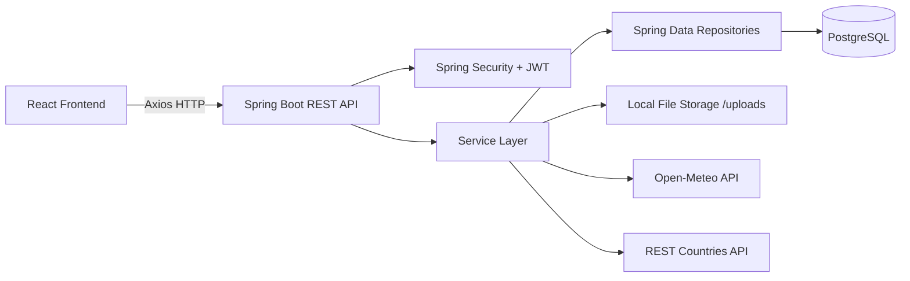
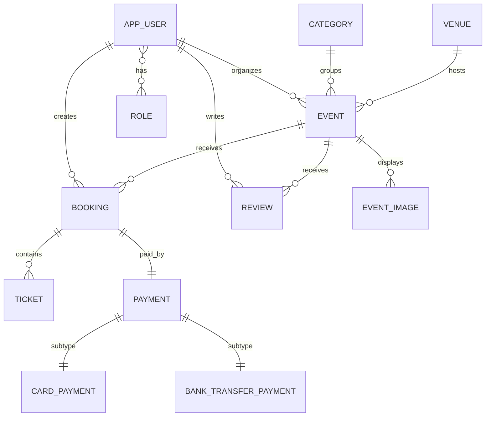
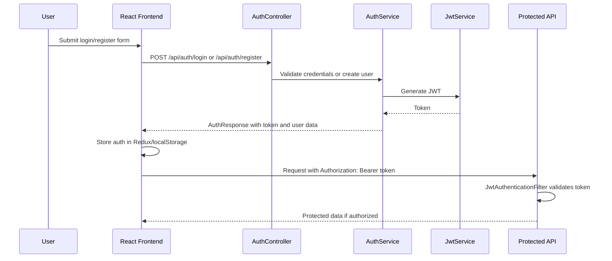
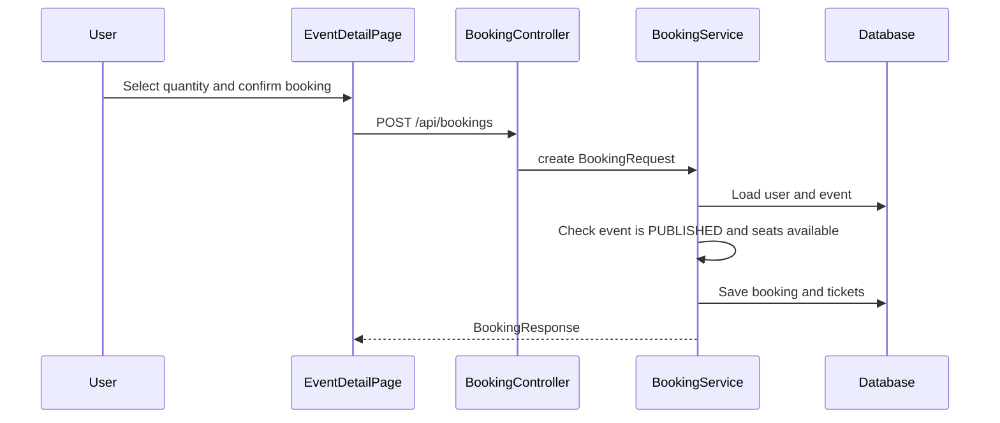
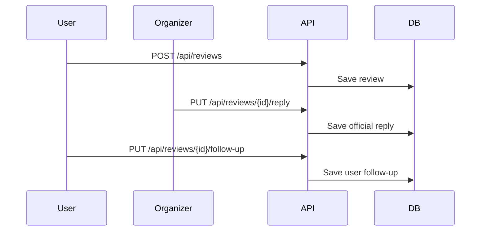

# EventHub NotebookLM Study Dossier

This dossier is designed to be uploaded to NotebookLM as a single study source for the EventHub project. It explains the project from the perspective of an oral exam: what was built, why it was built that way, where each feature lives in the codebase, how the backend and frontend communicate, and how to answer professor-style questions.

## 1. Executive Summary

EventHub is a full-stack event management platform.

The application allows:

- Guests to browse public events and inspect event details.
- Regular users to register, log in, book tickets, manage profile images, write reviews, and answer official replies.
- Organizers to create, edit, delete, and enrich events with cover/gallery images.
- Organizers and admins to reply officially to event reviews.
- Admins to manage shared catalog data such as categories and venues and view platform statistics.

The project is split into:

- `backend/`: Spring Boot REST API with PostgreSQL, Spring Security, JWT, JPA/Hibernate, validation, file uploads, and external API integrations.
- `frontend/`: React + Vite application with React Router, Redux Toolkit, thunk-style async actions, Axios, protected routes, controlled forms, dashboards, and role-aware UI.
- `postman/`: Postman collection for testing API flows.
- `requirements.md`: original frontend and backend assignment requirements.
- `README.md`: run instructions and high-level documentation.

The project language used in code and UI is English.

## 2. Requirements Compliance Map

### Frontend Requirements

| Requirement | Implementation |
|---|---|
| React application | `frontend/src/main.jsx`, `frontend/src/App.jsx` |
| Components | `AppLayout`, `AuthForm`, route pages |
| `useState` and `useEffect` | Used across pages: `EventsPage`, `DashboardPage`, `OrganizerDashboardPage`, `EventDetailPage`, `AdminDashboardPage` |
| Redux global state | `frontend/src/store/authSlice.js`, `frontend/src/store/store.js` |
| Thunk-style async operations | `createAsyncThunk` for login/register in `authSlice.js`; async API calls in page handlers |
| Routing | `createBrowserRouter` in `frontend/src/App.jsx` |
| At least six pages | Home, Events, Event Detail, Login, Register, Dashboard, Organizer Dashboard, Admin Dashboard, Not Found |
| Listing with filters and pagination | `frontend/src/pages/EventsPage.jsx` |
| Detail route | `/events/:eventId` in `EventDetailPage.jsx` |
| Login system | `AuthForm.jsx`, `authSlice.js`, backend `/api/auth/login` |
| At least two roles | Three roles: `ROLE_USER`, `ROLE_ORGANIZER`, `ROLE_ADMIN` |
| Role-specific views | `ProtectedRoute.jsx`, `roles.js`, dashboard conditional rendering |
| External API use | Backend Open-Meteo and REST Countries are consumed by frontend via API endpoints |
| At least four controlled forms | Login, register, admin category, admin venue, event create/edit, booking, review, profile image, official reply |
| Validation and errors | Frontend local validation plus backend structured errors |
| Styling | Custom CSS in `frontend/src/styles.css` with responsive layout, cards, hover states, animations |

### Backend Requirements

| Requirement | Implementation |
|---|---|
| Spring backend | `backend/src/main/java/com/eventhub/EventHubApplication.java` |
| PostgreSQL persistence | `backend/src/main/resources/application.yml` |
| At least eight tables | `app_users`, `roles`, `user_roles`, `events`, `venues`, `categories`, `bookings`, `tickets`, `reviews`, `payments`, `event_images` |
| Meaningful relationships | JPA relations between users, roles, events, venues, categories, bookings, tickets, reviews, payments, images |
| Inheritance | `Payment` base class with `CardPayment` and `BankTransferPayment`, single-table inheritance |
| Complete user management | `AuthService`, `AuthController`, `UserProfileService`, `UserProfileController` |
| Email/password/profile image | `AppUser` entity and auth DTOs |
| Profile image updatable | URL update and upload endpoint |
| REST APIs | Controllers under `backend/src/main/java/com/eventhub/api/controllers` |
| JWT auth | `JwtService`, `JwtAuthenticationFilter`, `SecurityConfig` |
| Three roles | `RoleName`: `ROLE_USER`, `ROLE_ORGANIZER`, `ROLE_ADMIN` |
| Filtering/sorting/combined conditions | `EventService.search(...)` with JPA `Specification` and Spring `Pageable` |
| Aggregations | `AdminStatsService` and `ReviewRepository.averageRatingForEvent` |
| Structured errors | `GlobalExceptionHandler`, `ApiError` |
| Third-party APIs | `WeatherService` uses Open-Meteo; `CountryInfoService` uses REST Countries |
| Postman collection | `postman/EventHub.postman_collection.json` |

## 3. Technology Stack

### Frontend

- React
- Vite
- React Router DOM
- Redux Toolkit
- Axios
- Lucide React icons
- CSS modules are not used; styling is centralized in `frontend/src/styles.css`

### Backend

- Java 21
- Spring Boot
- Spring Web
- Spring Security
- Spring Data JPA
- Hibernate
- PostgreSQL
- H2 for tests
- JWT via `io.jsonwebtoken`
- Maven
- RestTemplate for third-party APIs

### Testing and Tooling

- Maven tests: `mvn test`
- Frontend build: `npm run build`
- Postman collection for manual API testing
- Local upload storage under `backend/uploads/`

## 4. High-Level Architecture



The frontend never accesses the database directly. It communicates through REST endpoints. The backend owns authentication, authorization, persistence, validation, business rules, and integration logic.

## 5. Backend Package Map

| Package | Purpose |
|---|---|
| `com.eventhub.auth` | Authentication controller/service |
| `com.eventhub.auth.dto` | Login/register/auth response DTOs |
| `com.eventhub.api.controllers` | REST controllers for domain features |
| `com.eventhub.api.services` | Business logic |
| `com.eventhub.api.dto` | Request/response DTOs |
| `com.eventhub.api.mappers` | Entity-to-DTO mapping |
| `com.eventhub.domain.entities` | JPA entities |
| `com.eventhub.domain.enums` | Enums for roles/statuses |
| `com.eventhub.repositories` | Spring Data JPA repositories |
| `com.eventhub.security` | JWT, user principal, security config |
| `com.eventhub.integrations` | External API services |
| `com.eventhub.common` | Shared error response handling |
| `com.eventhub.config` | Uploads, RestTemplate, seed data |
| `com.eventhub.health` | Health endpoint |

## 6. Frontend Structure Map

| Path | Purpose |
|---|---|
| `frontend/src/App.jsx` | Router configuration |
| `frontend/src/main.jsx` | React entrypoint |
| `frontend/src/components/AppLayout.jsx` | Shared top navigation and layout |
| `frontend/src/components/AuthForm.jsx` | Login/register controlled form |
| `frontend/src/router/ProtectedRoute.jsx` | Auth/role route protection |
| `frontend/src/store/authSlice.js` | Redux auth state and thunks |
| `frontend/src/api/*.js` | Axios wrappers for backend endpoints |
| `frontend/src/pages/HomePage.jsx` | Landing/home page |
| `frontend/src/pages/EventsPage.jsx` | Event listing, filters, pagination |
| `frontend/src/pages/EventDetailPage.jsx` | Event detail, booking, weather, reviews |
| `frontend/src/pages/DashboardPage.jsx` | User/admin/organizer dashboard |
| `frontend/src/pages/OrganizerDashboardPage.jsx` | Event management |
| `frontend/src/pages/AdminDashboardPage.jsx` | Category, venue, stats management |
| `frontend/src/styles.css` | Global visual design |

## 7. Domain Model

### Main Entities

- `AppUser`: email, encrypted password, name, surname, registration date, profile image URL, city, favorite event type, roles.
- `Role`: role name, used for authorization.
- `Category`: event category, e.g. music or technology.
- `Venue`: location with city, country, address, capacity, latitude, longitude.
- `Event`: title, description, date range, price, available seats, status, organizer, venue, category, cover image.
- `EventImage`: additional gallery images for an event.
- `Booking`: confirmed reservation of tickets for an event.
- `Ticket`: individual ticket records linked to a booking.
- `Review`: rating/comment by a user, official reply by organizer/admin, follow-up by user.
- `Payment`: abstract base class for payment hierarchy.
- `CardPayment`: payment subtype with card brand and last four digits.
- `BankTransferPayment`: payment subtype with bank name and IBAN.

### Entity Relationship Diagram



### Inheritance Explanation

The backend satisfies the inheritance requirement through:

- `Payment`
- `CardPayment`
- `BankTransferPayment`

`Payment` is an abstract JPA entity using:

- `@Inheritance(strategy = InheritanceType.SINGLE_TABLE)`
- `@DiscriminatorColumn(name = "payment_type")`

This means all payment records are stored in one table, with a discriminator column indicating the subtype. This is justified because all payments share common fields such as amount, status, provider reference, and booking, while subtypes hold method-specific fields.

## 8. Authentication and Authorization

### JWT Flow



### Important Files

- `SecurityConfig.java`: defines public routes, protected admin/organizer routes, CORS, stateless sessions, password encoder, and authentication provider.
- `JwtAuthenticationFilter.java`: reads the `Authorization` header, extracts the token, validates it, and sets the authenticated user in Spring Security.
- `JwtService.java`: creates and validates JWTs.
- `UserPrincipal.java`: adapts `AppUser` into Spring Security `UserDetails`.
- `CustomUserDetailsService.java`: loads users by email.
- `authSlice.js`: stores token/user on the frontend.

### Roles

- `ROLE_USER`: can book events, write reviews, update profile image, follow up official replies.
- `ROLE_ORGANIZER`: can manage events and reply to reviews on owned events.
- `ROLE_ADMIN`: can manage catalog data, view stats, manage all events, and reply to all reviews.

## 9. Backend REST API Overview

### Authentication

| Method | Endpoint | Purpose |
|---|---|---|
| `POST` | `/api/auth/register` | Register user and return JWT |
| `POST` | `/api/auth/login` | Authenticate and return JWT |

### User Profile

| Method | Endpoint | Role | Purpose |
|---|---|---|---|
| `GET` | `/api/users/me` | Authenticated | Current user |
| `PUT` | `/api/users/me/profile-image` | Authenticated | Update profile image URL |
| `POST` | `/api/users/me/profile-image/upload` | Authenticated | Upload profile image file |

### Categories and Venues

| Method | Endpoint | Role | Purpose |
|---|---|---|---|
| `GET` | `/api/categories` | Public | List categories |
| `POST` | `/api/admin/categories` | Admin | Create category |
| `PUT` | `/api/admin/categories/{id}` | Admin | Update category |
| `DELETE` | `/api/admin/categories/{id}` | Admin | Delete category |
| `GET` | `/api/venues` | Public | List venues |
| `POST` | `/api/admin/venues` | Admin | Create venue |
| `PUT` | `/api/admin/venues/{id}` | Admin | Update venue |
| `DELETE` | `/api/admin/venues/{id}` | Admin | Delete venue |

### Events

| Method | Endpoint | Role | Purpose |
|---|---|---|---|
| `GET` | `/api/events` | Public | Filtered/paginated event search |
| `GET` | `/api/events/{id}` | Public | Event detail |
| `GET` | `/api/organizer/events` | Organizer/Admin | Managed events |
| `POST` | `/api/organizer/events` | Organizer/Admin | Create event |
| `PUT` | `/api/organizer/events/{id}` | Owner/Admin | Update event |
| `DELETE` | `/api/organizer/events/{id}` | Owner/Admin | Delete event |
| `POST` | `/api/organizer/events/{id}/image/upload` | Owner/Admin | Upload cover image |
| `POST` | `/api/organizer/events/{id}/gallery` | Owner/Admin | Upload gallery images |
| `DELETE` | `/api/organizer/events/{id}/gallery/{imageId}` | Owner/Admin | Delete gallery image |

### Bookings and Reviews

| Method | Endpoint | Role | Purpose |
|---|---|---|---|
| `POST` | `/api/bookings` | User | Book event tickets |
| `GET` | `/api/bookings/me` | User | User's bookings |
| `POST` | `/api/reviews` | User | Create event review |
| `GET` | `/api/reviews/me` | User | User's reviews |
| `GET` | `/api/reviews/manageable` | Organizer/Admin | Reviews to answer |
| `PUT` | `/api/reviews/{reviewId}/reply` | Organizer/Admin | Official reply |
| `PUT` | `/api/reviews/{reviewId}/follow-up` | Review author | User follow-up |
| `GET` | `/api/events/{eventId}/reviews` | Public | Reviews for event |

### Integrations and Stats

| Method | Endpoint | Purpose |
|---|---|---|
| `GET` | `/api/events/{eventId}/weather` | Open-Meteo forecast for event venue/time |
| `GET` | `/api/venues/country-info?country=Italy` | REST Countries info |
| `GET` | `/api/admin/stats` | Admin platform statistics |

## 10. Business Logic by Service

### `AuthService`

Responsible for registration and login.

Key points:

- Prevents duplicate email with `existsByEmailIgnoreCase`.
- Stores email lowercase and trimmed.
- Hashes password with BCrypt.
- Assigns one selected role.
- Builds `AuthResponse` containing token and user data.

Interview answer:

> Passwords are never stored as plain text. They are hashed using `PasswordEncoder`, configured as `BCryptPasswordEncoder` in `SecurityConfig`.

### `EventService`

Responsible for event CRUD, search, ownership checks, cover uploads, and gallery uploads.

Important logic:

- `search(...)` builds dynamic JPA `Specification` filters.
- `findManaged(...)` returns all events to admins, but only owned events to organizers.
- `ensureOwnerOrAdmin(...)` blocks non-owner organizers.
- `apply(...)` validates end date after start date and resolves `Venue`/`Category`.
- `uploadImage(...)` updates cover image.
- `uploadGalleryImages(...)` adds event gallery images.

Professor-style question:

> Why use `Specification` instead of many repository methods?

Suggested answer:

> Because the event search supports combined optional filters: city, category, status, date range, plus pagination and sorting. A `Specification` composes these dynamically without creating many method combinations.

### `BookingService`

Responsible for booking tickets.

Important rules:

- User must exist.
- Event must exist.
- Event must be `PUBLISHED`.
- Available seats must be enough.
- Seats are decremented transactionally.
- Booking total price is `basePrice * quantity`.
- One `Ticket` entity is created per booked seat.

### `ReviewService`

Responsible for review creation and review conversations.

Important rules:

- One review per user/event using both a database unique constraint and service validation.
- Organizers can reply only to their own event reviews.
- Admins can reply to all reviews.
- Users can add follow-up only to their own review and only after an official reply exists.
- `findManageable(...)` powers the admin/organizer dashboard.

### `FileStorageService`

Responsible for validating and storing image files.

Important behavior:

- Accepts only JPG, PNG, WEBP, GIF.
- Maximum size is 5 MB.
- Generates UUID filenames.
- Sanitizes upload folders.
- Stores files locally under configured upload directory.
- Returns absolute URLs using `ServletUriComponentsBuilder`.

Interview answer:

> Local file storage is acceptable for a local academic project. In production I would replace it with cloud object storage such as S3, Azure Blob Storage, or Cloudinary.

## 11. Error Handling

`GlobalExceptionHandler` centralizes error responses.

Handled cases:

- `MethodArgumentNotValidException`: validation errors with field map.
- `IllegalArgumentException`: bad request.
- `IllegalStateException`: operational upload/storage errors as bad request.
- `EntityNotFoundException`: not found.
- `AccessDeniedException`: forbidden.
- Generic `Exception`: internal server error.

API errors use `ApiError`, containing:

- timestamp
- status
- error
- message
- path
- validation errors

## 12. Third-Party Integrations

### Open-Meteo

File: `WeatherService.java`

Purpose:

- Fetch hourly weather forecast for the venue coordinates.
- Find forecast point closest to event start time.
- Return a readable summary for the event detail page.

### REST Countries

File: `CountryInfoService.java`

Purpose:

- Fetch official/common country data.
- Expose capital, currency, languages, region, subregion, flag.
- Used as meaningful venue/country enrichment.

## 13. Frontend Routing

File: `frontend/src/App.jsx`

Routes:

- `/`: home
- `/events`: listing page
- `/events/:eventId`: dynamic detail page
- `/login`: login
- `/register`: registration
- `/dashboard`: authenticated dashboard
- `/organizer`: organizer/admin protected route
- `/admin`: admin protected route
- `*`: not found

Protected routes use `ProtectedRoute.jsx`.

## 14. Frontend Auth State

File: `frontend/src/store/authSlice.js`

Responsibilities:

- Login async thunk.
- Register async thunk.
- Store token and user.
- Persist auth to `localStorage`.
- Clear credentials on logout or unauthorized response.
- Update current user after profile image changes.

Axios attaches token in `frontend/src/api/client.js`.

## 15. Frontend Pages and Responsibilities

### `HomePage.jsx`

Landing page with project positioning, visual hero, and entry actions.

### `EventsPage.jsx`

Public event listing.

Features:

- City filter.
- Category filter.
- Status filter.
- Search button.
- Pagination.
- Event cards.
- Asset URL normalization through `toAssetUrl`.

### `EventDetailPage.jsx`

Event detail.

Features:

- Cover image.
- Optional gallery images.
- Event metadata.
- Booking form for regular users only.
- Weather summary.
- Public reviews.
- Organizer/admin official reply form.

### `DashboardPage.jsx`

Role-aware dashboard.

For all authenticated users:

- Profile image URL update.
- Profile image upload.

For `ROLE_USER`:

- Personal bookings.
- Personal reviews.
- Review follow-up to official replies.

For `ROLE_ORGANIZER` and `ROLE_ADMIN`:

- Tool links.
- Reviews to manage.
- Official review replies.

### `OrganizerDashboardPage.jsx`

Event management.

Features:

- Create/update event form.
- Controlled fields for title, description, dates, price, seats, venue, category, status.
- Cover image URL.
- Cover image file upload.
- Gallery image upload.
- Gallery image deletion.
- Managed events list with edit/delete.

### `AdminDashboardPage.jsx`

Admin catalog and analytics page.

Features:

- Category management.
- Venue management.
- Admin stats.
- Country info lookup.

### `AuthForm.jsx`

Shared login/register form.

Features:

- Controlled inputs.
- Local validation for email/password/name/surname.
- Role selection on register.
- Profile image URL.
- Profile image upload during registration.
- Preview before upload.

## 16. Controlled Forms Inventory

| Form | File | Validation |
|---|---|---|
| Login | `AuthForm.jsx` | email contains `@`, password length |
| Register | `AuthForm.jsx` | email, password, name, surname |
| Profile image URL/upload | `DashboardPage.jsx` | required URL/file selected |
| Event create/edit | `OrganizerDashboardPage.jsx` | title, description, dates, price, seats, venue/category |
| Booking | `EventDetailPage.jsx` | quantity min/max |
| Review | `DashboardPage.jsx` | backend validates rating/comment |
| Official reply | `DashboardPage.jsx`, `EventDetailPage.jsx` | non-empty reply |
| Category | `AdminDashboardPage.jsx` | backend request validation |
| Venue | `AdminDashboardPage.jsx` | backend request validation |

## 17. Upload System

### Backend

Files:

- `FileStorageService.java`
- `UploadConfig.java`
- `UploadProperties.java`
- `UserProfileController.java`
- `EventController.java`

Endpoints:

- `/api/users/me/profile-image/upload`
- `/api/organizer/events/{id}/image/upload`
- `/api/organizer/events/{id}/gallery`

Storage:

- Default local directory: `uploads`
- Public path: `/uploads`
- Ignored by Git via `.gitignore`

### Frontend

Files:

- `usersApi.js`
- `eventsApi.js`
- `AuthForm.jsx`
- `DashboardPage.jsx`
- `OrganizerDashboardPage.jsx`

Important point:

Axios must not manually force `multipart/form-data` without a boundary. The browser should generate the correct multipart boundary when `FormData` is passed.

## 18. Data Flow Examples

### Booking Flow



### Review Conversation Flow



## 19. Testing Strategy

### Backend Tests

Important files:

- `AuthControllerTests.java`
- `CoreApiTests.java`
- `ThirdPartyIntegrationTests.java`
- `EventHubApplicationTests.java`

Covered behavior:

- Authentication.
- Role-based access.
- Event CRUD and filtering.
- Draft visibility in organizer managed events.
- Booking.
- Review creation.
- Official replies.
- User follow-up.
- Profile upload.
- Event cover upload.
- Event gallery upload.
- Structured validation errors.
- Admin stats.
- Third-party integration behavior.

Run:

```bash
cd backend
mvn test
```

### Frontend Verification

Run:

```bash
cd frontend
npm run build
```

This checks that the React app compiles and bundles correctly.

## 20. Postman Collection

File:

`postman/EventHub.postman_collection.json`

Purpose:

- Demonstrates implemented backend features.
- Provides example payloads.
- Stores collection variables such as IDs and tokens.
- Supports manual testing of authentication, catalog, events, bookings, reviews, uploads, stats, and cleanup.

Important professor note:

> The assignment states that features not represented in Postman may not be evaluated. This collection exists to make the backend testable by a grader.

## 21. Requirement-to-Code Cheat Sheet

| If professor asks... | Point to... |
|---|---|
| Where is routing? | `frontend/src/App.jsx` |
| Where is global state? | `frontend/src/store/authSlice.js` |
| Where are protected routes? | `frontend/src/router/ProtectedRoute.jsx` |
| Where is JWT configured? | `SecurityConfig.java`, `JwtAuthenticationFilter.java`, `JwtService.java` |
| Where are roles enforced? | `SecurityConfig.java`, service ownership checks, frontend `roles.js` |
| Where are events filtered? | `EventService.search(...)` |
| Where are reviews handled? | `ReviewService.java`, `ReviewController.java` |
| Where is upload implemented? | `FileStorageService.java`, `UploadConfig.java` |
| Where are external APIs consumed? | `WeatherService.java`, `CountryInfoService.java` |
| Where are structured errors? | `GlobalExceptionHandler.java`, `ApiError.java` |
| Where is inheritance? | `Payment.java`, `CardPayment.java`, `BankTransferPayment.java` |
| Where are tests? | `backend/src/test/java/com/eventhub/...` |

## 22. Simulated Oral Exam Questions

### Easy Questions

1. What is EventHub?

Answer:

EventHub is a full-stack event management platform where users can browse events, book tickets, review events, and where organizers/admins can manage events, catalog data, images, and review replies.

2. Which frontend technologies are used?

Answer:

React, Vite, React Router, Redux Toolkit, Axios, Lucide icons, and custom CSS.

3. Which backend technologies are used?

Answer:

Spring Boot, Spring Web, Spring Security, Spring Data JPA, Hibernate, PostgreSQL, JWT, Maven, and RestTemplate.

4. What are the roles?

Answer:

`ROLE_USER`, `ROLE_ORGANIZER`, and `ROLE_ADMIN`.

5. Where is authentication stored on the frontend?

Answer:

In Redux state and persisted to `localStorage` by `authSlice.js`.

### Medium Questions

1. Why do you use DTOs instead of returning entities directly?

Answer:

DTOs prevent exposing internal entity structure, avoid lazy-loading serialization problems, and let the API control exactly what is returned.

2. Why is `EventService.search` built with JPA `Specification`?

Answer:

Because the filters are optional and combinable. Specification lets the service compose city, category, status, and date filters dynamically.

3. How does the app prevent an organizer from editing another organizer's event?

Answer:

`EventService.ensureOwnerOrAdmin` checks whether the authenticated user is admin or the event organizer. Otherwise it throws `AccessDeniedException`.

4. How does review reply permission work?

Answer:

Admins can reply to all reviews. Organizers can reply only to reviews on events they own. Users can only follow up on their own reviews after an official reply exists.

5. Why is local file storage acceptable here?

Answer:

For a local academic project it is simple, testable, and avoids external cloud setup. In production I would use cloud storage.

### Hard Questions

1. How would you scale uploads in production?

Answer:

I would move files from local disk to object storage, store only URLs/metadata in the database, add file scanning, support CDN delivery, and possibly generate thumbnails asynchronously.

2. What are the risks of storing JWT in localStorage?

Answer:

It is vulnerable to token theft if there is an XSS vulnerability. A more secure production approach could use httpOnly cookies, CSRF protection, and stricter CSP.

3. How would you prevent race conditions in booking seats?

Answer:

Currently seat reduction is transactional, but high concurrency could oversell if multiple transactions read the same seat count. In production I would use optimistic locking with a `@Version` field, pessimistic locks, or database constraints/atomic update queries.

4. What could be improved in test coverage?

Answer:

Frontend unit/integration tests could be added with React Testing Library. Backend could add more negative cases for upload validation, booking concurrency, and role boundaries.

5. Why use `@PrePersist`?

Answer:

It ensures fields like `registrationDate`, `createdAt`, and similar timestamps are set automatically before the entity is first inserted.

## 23. File-by-File Study Notes for Critical Files

### `SecurityConfig.java`

Study points:

- Stateless session management means the server does not keep login sessions.
- CSRF is disabled because the API is stateless and uses bearer tokens.
- Public routes include auth, health, public event/category/venue reads, weather/reviews reads, and uploaded assets.
- `/api/admin/**` is admin-only.
- `/api/organizer/**` is organizer-or-admin.
- Every other route requires authentication.
- CORS allows local frontend origins and local network testing.

### `JwtAuthenticationFilter.java`

Study points:

- Runs once per request.
- Reads `Authorization`.
- Requires `Bearer ` prefix.
- Extracts username/email.
- Loads user details.
- Validates token.
- Places authentication in `SecurityContextHolder`.

### `AuthService.java`

Study points:

- `register` checks duplicates, resolves role, hashes password, saves user.
- `login` delegates credential checking to `AuthenticationManager`.
- `buildResponse` generates JWT and returns user identity.

### `EventService.java`

Study points:

- Central event business logic.
- Dynamic search with Specifications.
- Ownership/security checks.
- Event creation/update validation.
- Cover and gallery image upload delegation.

### `ReviewService.java`

Study points:

- Separates personal reviews from manageable reviews.
- Enforces one review per user/event.
- Enforces role and ownership for official replies.
- Enforces author-only follow-up.

### `FileStorageService.java`

Study points:

- Validates file presence, size, and content type.
- Creates upload directories.
- Uses UUID filenames.
- Uses `Files.copy`.
- Returns absolute URLs.

### `authSlice.js`

Study points:

- Uses Redux Toolkit slice.
- Uses async thunks for login/register.
- Persists auth in localStorage.
- Provides selectors.
- Updates current user after profile changes.

### `DashboardPage.jsx`

Study points:

- Role-aware dashboard.
- Regular users see bookings/reviews.
- Admin/organizer users see management tools and manageable reviews.
- Profile image upload uses FormData.

### `OrganizerDashboardPage.jsx`

Study points:

- Complex controlled form.
- Validates local fields before API call.
- Creates or updates event.
- Uploads cover/gallery images after event save.
- Displays managed event list and thumbnails.

### `EventDetailPage.jsx`

Study points:

- Fetches event, reviews, and weather in parallel.
- Allows booking only for `ROLE_USER`.
- Displays review conversation.
- Allows admin/organizer official replies.

## 24. Known Tradeoffs and Future Improvements

Useful honest answers for the oral exam:

- Upload files are stored locally; production should use object storage.
- JWT in localStorage is convenient but not the strongest production choice.
- Payment inheritance is modeled but not deeply exposed in UI.
- Frontend has build verification but not automated UI tests.
- Booking seat decrement could be improved for heavy concurrency.
- Admin UI could include more search/filter controls for large catalogs.
- Uploaded files are not deleted from disk when database references are removed.

## 25. How To Run The Project

Backend:

```bash
cd backend
mvn spring-boot:run
```

Frontend:

```bash
cd frontend
npm install
npm run dev
```

Backend tests:

```bash
cd backend
mvn test
```

Frontend build:

```bash
cd frontend
npm run build
```

Default URLs:

- Frontend: `http://localhost:5173`
- Backend: `http://localhost:8080`

## 26. Suggested NotebookLM Prompts

Use these prompts after uploading this file:

1. "Create a complete oral exam simulation for this EventHub project."
2. "Ask me 30 questions, starting easy and ending with advanced backend architecture questions."
3. "Explain the JWT flow using the project files."
4. "Quiz me on all frontend requirements and where they are implemented."
5. "Quiz me on all backend requirements and where they are implemented."
6. "Generate flashcards for each controller, service, and entity."
7. "Pretend you are my professor and challenge every design decision."
8. "Explain the project as if I had to present it in 10 minutes."
9. "Find weaknesses or improvement opportunities in this project."
10. "Create a database schema study guide from the entity descriptions."

## 27. Final Presentation Script

Short version:

> EventHub is a full-stack event platform built with React and Spring Boot. The frontend uses React Router for navigation, Redux Toolkit for authentication state, Axios for API calls, and role-aware dashboards. The backend uses Spring Boot, JPA/Hibernate, PostgreSQL, JWT authentication, structured validation, and REST controllers. The domain includes users, roles, events, venues, categories, bookings, tickets, reviews, event images, and an inherited payment hierarchy. The app integrates with Open-Meteo for event weather and REST Countries for venue country data. It includes Postman requests and backend integration tests, plus frontend production build verification.

Longer version:

> I chose an event management platform because it naturally supports multiple roles, real CRUD workflows, external APIs, bookings, reviews, file uploads, filtering, pagination, dashboards, and meaningful relationships. The architecture separates frontend presentation, backend REST controllers, service-level business rules, repositories, entities, and DTOs. Security is stateless with JWT. Admins manage catalog data and statistics, organizers manage their own events and respond to reviews, and users book events and participate in review conversations. The project satisfies both frontend and backend requirements and includes tests and Postman support for evaluation.

